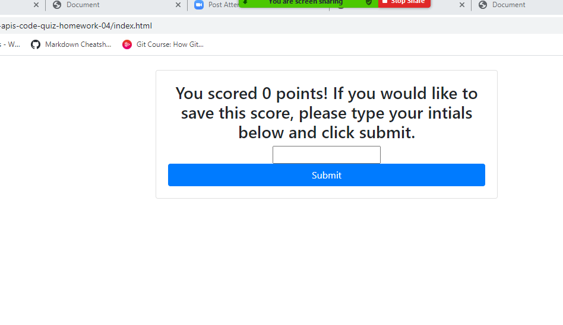

# Code Quiz using DOM Manipulation

## Table of Contents 

* [Installation](#installation)
* [Usage](#usage)
* [Credits](#credits)
* [MIT_License](#mit_license)

## Installation

1. Clone the repo and 
2. Run the index.html file in default browser.

## Usage 

This code quiz was designed to fully run in the browser, take in the user's input and update the page in real time. This type of application is highly useful in assessments because it gives meaningful feedback instantly. It was also designed to meet the criteria for GT Full-stack Flex program homework requirements. 

It is built using DOM manipulation techniques in Javascript and customized based on acceptance criteria provided in class.

Link to deployed application:

https://christinastarr19.github.io/gt-web-apis-code-quiz-homework-04/

## Credits

This was a solo project completed as homework for the Georgia Tech, FullStack Flex program.

## MIT_License

Copyright (c) [2020] [Christina Cunningham Starr]

Permission is hereby granted, free of charge, to any person obtaining a copy
of this software and associated documentation files (the "Software"), to deal
in the Software without restriction, including without limitation the rights
to use, copy, modify, merge, publish, distribute, sublicense, and/or sell
copies of the Software, and to permit persons to whom the Software is
furnished to do so, subject to the following conditions:

The above copyright notice and this permission notice shall be included in all
copies or substantial portions of the Software.

THE SOFTWARE IS PROVIDED "AS IS", WITHOUT WARRANTY OF ANY KIND, EXPRESS OR
IMPLIED, INCLUDING BUT NOT LIMITED TO THE WARRANTIES OF MERCHANTABILITY,
FITNESS FOR A PARTICULAR PURPOSE AND NONINFRINGEMENT. IN NO EVENT SHALL THE
AUTHORS OR COPYRIGHT HOLDERS BE LIABLE FOR ANY CLAIM, DAMAGES OR OTHER
LIABILITY, WHETHER IN AN ACTION OF CONTRACT, TORT OR OTHERWISE, ARISING FROM,
OUT OF OR IN CONNECTION WITH THE SOFTWARE OR THE USE OR OTHER DEALINGS IN THE
SOFTWARE.
